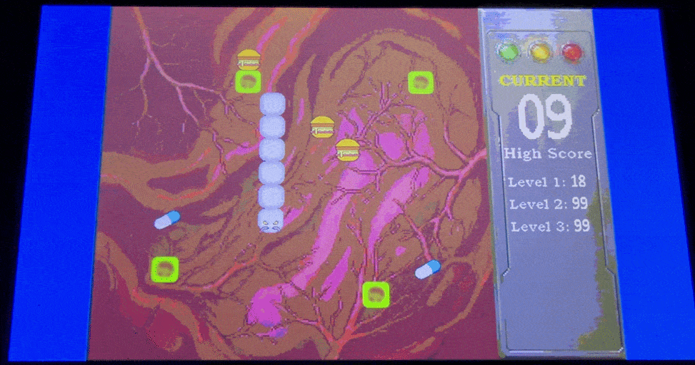

# Worm: FPGA-Based Interactive Arcade Game 

## Overview
**Worm** is a hardware-level reimagining of the classic Snake game with a medical twist. Designed entirely in **SystemVerilog** and deployed on an FPGA, the player controls a medical tracking device (the worm) navigating inside a stomach to eradicate an infection by consuming medical pills.

This project was developed as the final assignment Lab 1A coursework, showcasing real-time hardware logic, VGA rendering, and audio integration.

## Key Hardware Features
* **Custom VGA Controller:** Real-time rendering of medical-themed backgrounds, dynamic UI (Score/High Score), and sprite-based game entities using `.mif` memory blocks.
* **Complex Finite State Machines (FSM):** Manages core game loops, multi-level progression (Levels 1-3 with increasing difficulty), collision detection, and user inputs.
* **Audio Codec Integration:** Hardware-level sound management for gameplay music and sound effects utilizing an I2C audio codec controller.
* **Randomized Hardware Logic:** Implemented LFSR (Linear-Feedback Shift Register) logic for randomized pill spawning and obstacle generation.
* **Dynamic Modifiers:** Integrated special food types (Speed modifiers, Shrink modifiers) that dynamically alter the hardware timing and FSM states.

## Tech Stack
* **Language:** SystemVerilog, Verilog
* **Tools:** Intel Quartus Prime, ModelSim (for testbench verification)
* **Hardware:** FPGA Board (Targeted with standard VGA and Audio DAC peripherals)

## Repository Structure
* `/RTL` - Core SystemVerilog modules, FSMs, and Block Design Files.
* `/assets` - Memory Initialization Files (.mif) for sprite and background graphics.
* `/simulation` - Vector Waveform Files (.vwf) for logic verification.
